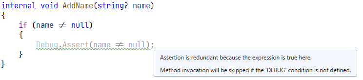
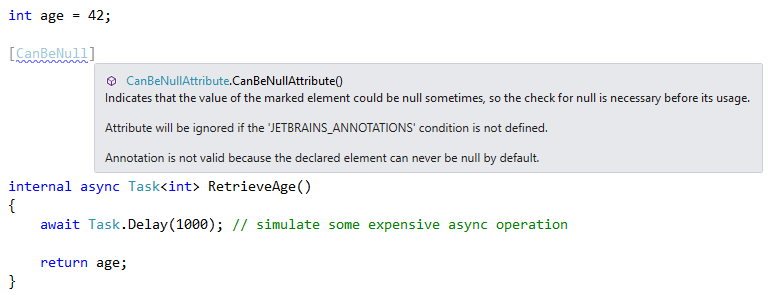

#  ReCommended Extension for ReSharper 

The ReCommended Extension for ReSharper augments the sophisticated code analysis engine by providing more rules not (yet) available from JetBrains. Among the most interesting features are

- detection of redundant assertions,
- inappropriate use of `async void`,
- exception analyzer (exceptions that should never be thrown or caught, exceptions thrown in unexpected locations),
- array initializers (empty arrays or arrays initialized with default values),
- `await` expression analyzer (add `.ConfigureAwait(false)` for last expressions, remove `async`/`await` for single expressions),
- `ValueTask`/`ValueTask<T>` analyzer (possible multiple consumption),
- incorrect use of `ArgumentException` constructor parameters,
- locking on weak identity objects,
- using `yield return` inside the `lock` blocks,
- incorrect use of ReSharper annotations,
- and lots more.

The most highlightings also have quick fixes for obvious solutions.

Another feature of the extension are new context actions that simply save time for accomplishing everyday tasks, e.g. for adding ReSharper annotations, putting `.ConfigureAwait(false)`, etc.

[show more...](https://github.com/prodot/ReCommended-Extension/wiki)

# Some Screenshots

# Installation

To install the ReCommended Extension use the ReSharper's Extension Manager.

# Limitations

- The extension works only with C# and XAML files.

# Bugs? Questions? Suggestions?

Please feel free to [report them](https://github.com/prodot/ReCommended-Extension/issues).
