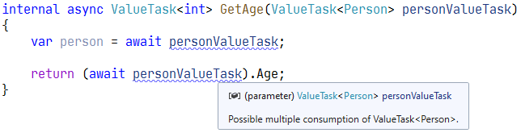

#  ReCommended Extension for ReSharper and Rider
  

The ReCommended Extension for ReSharper and Rider augments the sophisticated code analysis engine by providing more rules not (yet) available from JetBrains. Among the most interesting features are

- advanced disposable object analysis built around the `[MustDisposeResource]` and `[HandlesResourceDisposal]` annotations,
- detection of more cases where collection expressions can be used,
- LINQ and base type analyzers (encourage the use of modern language features, detect unused arguments),
- format specifier analyzers (detect redundant specifiers, redundant precision specifiers),
- inappropriate use of `async void`,
- exception analyzer (exceptions that should never be thrown or caught, exceptions thrown in unexpected locations),
- detection of redundant assertions,
- array initializers (empty arrays or arrays initialized with default values),
- `await` expression analyzer (add `.ConfigureAwait(false)` for last expressions),
- `ValueTask`/`ValueTask<T>` analyzer (possible multiple consumption),
- incorrect use of `ArgumentException` constructor parameters,
- locking on weak identity objects,
- use of `yield return` inside the `lock` blocks,
- annotations analyzers (missing annotations, incorrectly used ReSharper annotations),
- and much more.

Most of the highlightings also have quick fixes for obvious solutions.

Another feature of the extension are new context actions that simply save time for accomplishing everyday tasks, e.g. for adding ReSharper annotations, adjusting XML doc comments, setting language injections, etc.

[show more...](https://github.com/prodot/ReCommended-Extension/wiki)

# Some Screenshots

# Installation

To install the ReCommended Extension use the ReSharper's Extension Manager or Rider's Plugins.

# Limitations

- The extension works only with C# and XAML files.

# Bugs? Questions? Suggestions?

Please feel free to [report them](https://github.com/prodot/ReCommended-Extension/issues).
